# Ask Finance - AI Finance Assistant Architecture


https://github.com/user-attachments/assets/d470fdce-99fc-42e6-9b47-f367bff0a7dd


## Executive Summary

Ask Finance is an enterprise-grade AI-powered financial assistant designed to serve as a virtual financial business partner for organizations with multiple business units and regions. The system enables natural language queries about financial data, provides role-based access control, and generates insights in multiple formats (text, Excel, PowerPoint).

### Key Capabilities

- **Natural Language Understanding**: Comprehends financial terminology (P&L, Opex, ROI, variance, cash flow, EBIT, etc.)
- **Multi-Source Data Integration**: Consolidates data from SAP, HFM, data lakes, and other enterprise systems
- **Role-Based Access Control**: Enforces fine-grained permissions at row, column, and dataset levels
- **Multi-Format Output**: Generates responses in text, visualizations, Excel, and PowerPoint
- **Explainable AI**: Provides citations and reasoning for all answers
- **Multi-Agent Architecture**: Scalable design with specialized agents for different financial domains
- **Real-Time & Historical Analytics**: Combines batch and streaming data processing

---

## System Architecture Overview

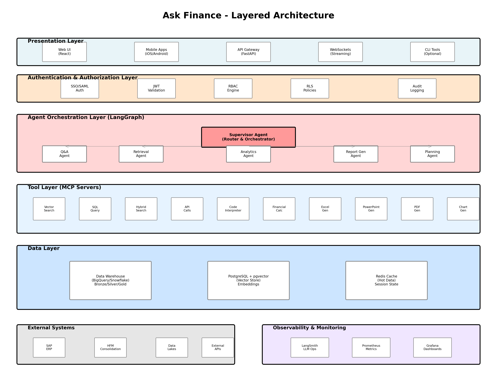

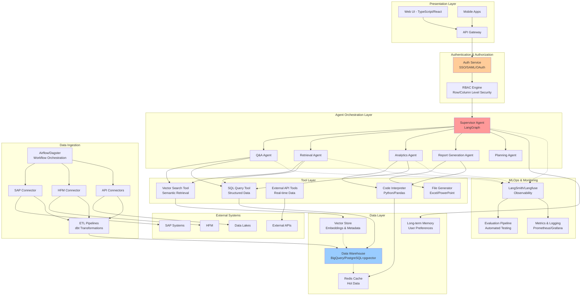

---

## 1. Data Layer Architecture

### 1.1 Data Warehouse Design

We implement a **Medallion Architecture** with semantic layer for optimal data organization and query performance.

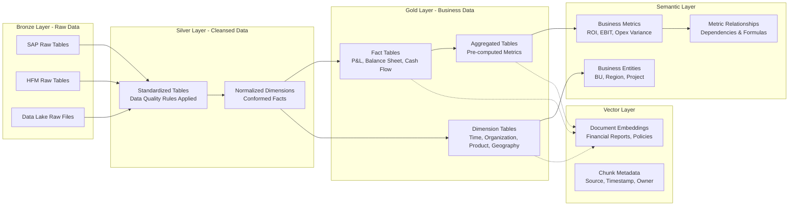

### 1.2 Technology Stack for Data Layer

**Data Warehouse Options:**

1. **Google BigQuery**
   - Native `VECTOR_SEARCH` function for semantic queries
   - Columnar storage optimized for analytics
   - Built-in partitioning and clustering
   - Seamless integration with dbt

2. **PostgreSQL with Extensions**
   - `pgvector` for vector similarity search
   - `pg_partman` for partition management
   - `citus` for horizontal scaling
   - `columnar` extension for columnar storage

### 1.3 Data Ingestion Pipeline

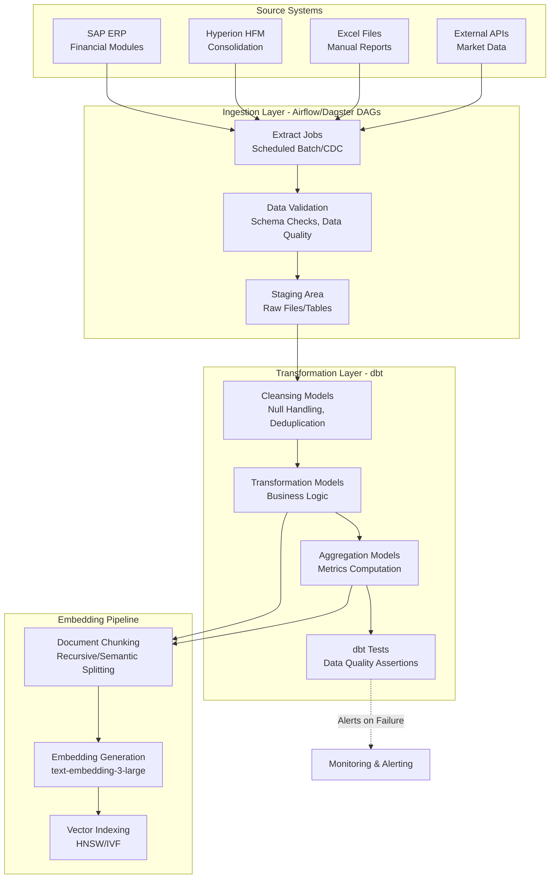

### 1.4 Chunking & Embedding Strategies

**Chunking Strategy Selection Matrix:**

| Data Type | Strategy | Chunk Size | Overlap | Rationale |
|-----------|----------|------------|---------|-----------|
| Financial Reports | Semantic Splitting | Variable (100-500 tokens) | 50 tokens | Preserves financial statement structure |
| Policy Documents | Recursive Character | 500 tokens | 100 tokens | Maintains policy context |
| Transaction Data | Metadata-Enhanced | By transaction group | N/A | Grouped by entity/period |
| Metric Definitions | Document-Specific | By metric | N/A | Each metric is atomic |

**Embedding Strategy - Hybrid Approach:**

1. **Dense Embeddings**: Use `text-embedding-3-large` or `text-embedding-3-small` for primary semantic search
2. **Sparse Embeddings**: Use BM25 for keyword matching on financial terms
3. **Metadata Filtering**: Pre-filter by user permissions, time period, business unit before vector search
4. **Parent-Child Relationships**: Store small chunks with references to parent documents for context expansion

**Advanced Indexing Techniques:**

```python
# Pseudo-code for multi-strategy embedding
class FinancialDocumentEmbedder:
    def embed_document(self, document):
        # Strategy 1: Chunk main content
        chunks = semantic_split(document.content)

        # Strategy 2: Generate summary embedding
        summary = generate_summary(document.content)
        summary_embedding = embed(summary)

        # Strategy 3: Generate hypothetical questions
        questions = generate_hypothetical_questions(document.content)
        question_embeddings = [embed(q) for q in questions]

        # Strategy 4: Extract and embed key metrics
        metrics = extract_financial_metrics(document.content)
        metric_embeddings = [embed(f"{m.name}: {m.definition}") for m in metrics]

        return {
            'chunk_embeddings': [embed(c) for c in chunks],
            'summary_embedding': summary_embedding,
            'question_embeddings': question_embeddings,
            'metric_embeddings': metric_embeddings,
            'metadata': document.metadata
        }
```

### 1.5 Data Governance Framework

```mermaid
graph TB
    subgraph "Data Quality"
        DBT_TEST[dbt Tests<br/>Uniqueness, Not Null, Relationships]
        GREAT_EXP[Great Expectations<br/>Statistical Validations]
        PYTEST[pytest<br/>Pipeline Integration Tests]
    end

    subgraph "Data Documentation"
        DBT_DOCS[dbt Documentation<br/>Table/Column Descriptions]
        SEMANTIC[Semantic Layer<br/>Metric Definitions]
        CATALOG[Data Catalog<br/>Searchable Metadata]
    end

    subgraph "Data Lineage"
        DBT_LINEAGE[dbt Lineage Graph<br/>Upstream/Downstream]
        AIRFLOW_LINEAGE[Airflow Lineage<br/>DAG Dependencies]
        OPENLINEAGE[OpenLineage<br/>Cross-Tool Tracking]
    end

    subgraph "Data Security"
        RBAC_LAYER[RBAC Implementation<br/>User/Role/Permission]
        RLS[Row-Level Security<br/>Dynamic Filtering]
        CLS[Column-Level Security<br/>Sensitive Data Masking]
        AUDIT[Audit Logs<br/>Access Tracking]
    end

    DBT_TEST --> MONITORING[Data Quality Dashboard]
    GREAT_EXP --> MONITORING
    PYTEST --> CI_CD[CI/CD Pipeline]

    DBT_DOCS --> CATALOG
    SEMANTIC --> CATALOG

    DBT_LINEAGE --> LINEAGE_VIEWER[Lineage Visualization]
    AIRFLOW_LINEAGE --> LINEAGE_VIEWER
    OPENLINEAGE --> LINEAGE_VIEWER

    RBAC_LAYER --> AUTH_SERVICE[Authentication Service]
    RLS --> QUERY_ENGINE[Query Engine Wrapper]
    CLS --> QUERY_ENGINE
    AUDIT --> SIEM[SIEM System]
```

**RBAC Implementation Details:**

| Role | Access Level | Data Scope | Capabilities |
|------|--------------|------------|--------------|
| Group CFO | Full Access | All BUs, All Regions | Read/Write, Cross-BU Analysis |
| BU General Manager | BU Access | Single BU, All Regions | Read/Write within BU |
| Regional Finance Manager | Regional Access | Single BU, Single Region | Read/Write within Region |
| Finance Analyst | Query Only | Assigned BU/Region | Read Only, No Raw Data |
| External Auditor | Audit Access | All BUs, Historical Only | Read Only, Audit Trail |

**Row-Level Security Implementation:**

```sql
-- Example: PostgreSQL RLS Policy
CREATE POLICY finance_data_access ON financial_facts
USING (
    business_unit IN (
        SELECT bu_code
        FROM user_permissions
        WHERE user_id = current_setting('app.user_id')::INT
    )
    AND fiscal_period >= (
        SELECT min_period
        FROM user_permissions
        WHERE user_id = current_setting('app.user_id')::INT
    )
);
```

---

## 2. Agent Architecture

### 2.1 Multi-Agent System Design

We implement a **Supervisor Pattern** with specialized agents for different financial domains.

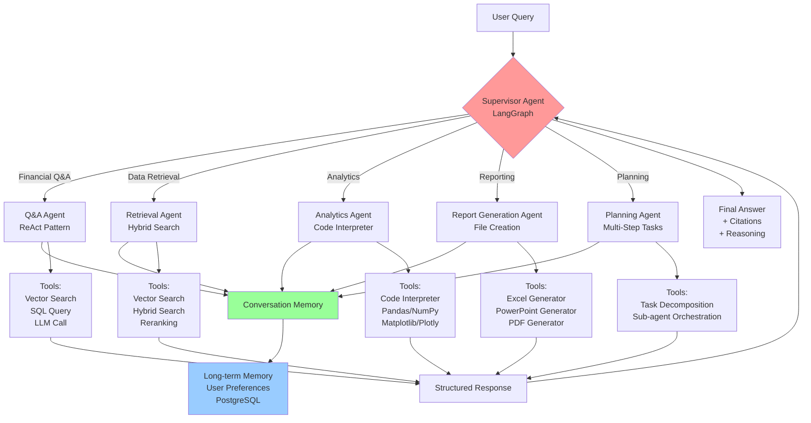

### 2.2 Agent Specifications

#### 2.2.1 Supervisor Agent

**Purpose**: Orchestrates sub-agents, routes queries, and synthesizes responses.

**Framework**: LangGraph with state management

**Workflow**:

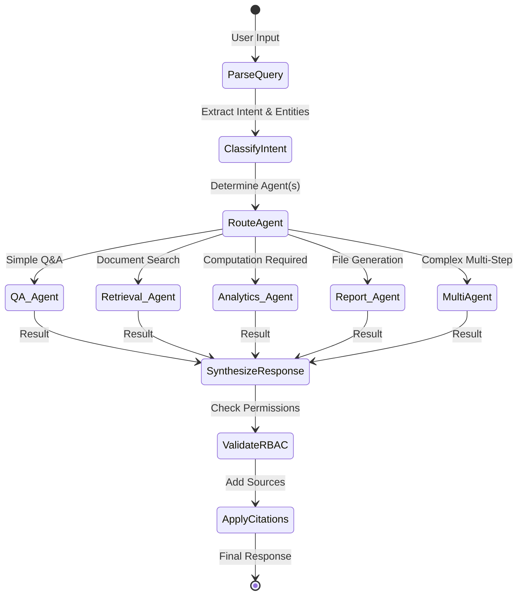

**Key Capabilities**:
- Intent classification using few-shot prompting
- Dynamic agent routing based on query complexity
- State management across agent interactions
- Error handling and fallback strategies
- Response synthesis with citation aggregation

#### 2.2.2 Q&A Agent

**Purpose**: Handles straightforward financial questions using ReAct pattern.

**Tools**:
- `vector_search`: Semantic search over embeddings
- `sql_query`: Execute SQL with RBAC filtering
- `financial_calculator`: Compute financial metrics

**Example Query Handling**:

```
User: "What was our Opex variance for Q2 in the Electronics division?"

ReAct Steps:
1. Thought: Need to find Q2 Opex data for Electronics division
2. Action: sql_query(query="SELECT ...", user_context={role, permissions})
3. Observation: Retrieved data shows...
4. Thought: Need to calculate variance vs budget
5. Action: financial_calculator(metric="variance", actual=..., budget=...)
6. Observation: Variance is -5.2M (-8.3%)
7. Thought: I can now answer the question
8. Final Answer: "The Opex variance for Q2 in Electronics was -$5.2M (-8.3%), indicating we overspent compared to budget..."
```

#### 2.2.3 Retrieval Agent

**Purpose**: Performs advanced document retrieval with hybrid search and reranking.

**Retrieval Strategy**:

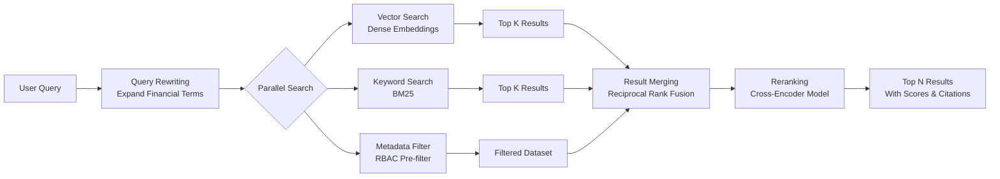

**Hybrid Search Implementation**:

```python
class HybridRetriever:
    def retrieve(self, query: str, user_context: dict, top_k: int = 10):
        # Step 1: Query rewriting
        expanded_query = self.expand_financial_terms(query)

        # Step 2: Metadata pre-filtering (RBAC)
        metadata_filter = self.build_rbac_filter(user_context)

        # Step 3: Parallel search
        vector_results = self.vector_search(
            query=expanded_query,
            top_k=top_k * 2,
            filter=metadata_filter
        )

        keyword_results = self.bm25_search(
            query=expanded_query,
            top_k=top_k * 2,
            filter=metadata_filter
        )

        # Step 4: Reciprocal Rank Fusion
        merged_results = self.rrf_merge(
            [vector_results, keyword_results],
            weights=[0.7, 0.3]
        )

        # Step 5: Reranking with cross-encoder
        reranked_results = self.rerank(
            query=query,
            documents=merged_results[:top_k * 2],
            top_k=top_k
        )

        return reranked_results
```

#### 2.2.4 Analytics Agent

**Purpose**: Performs data analysis, computations, and generates visualizations using code interpreter.

**Capabilities**:
- Execute Python code in sandboxed environment
- Access to pandas, numpy, scipy, statsmodels
- Visualization with matplotlib, seaborn, plotly
- Statistical analysis and forecasting

**Execution Flow**:

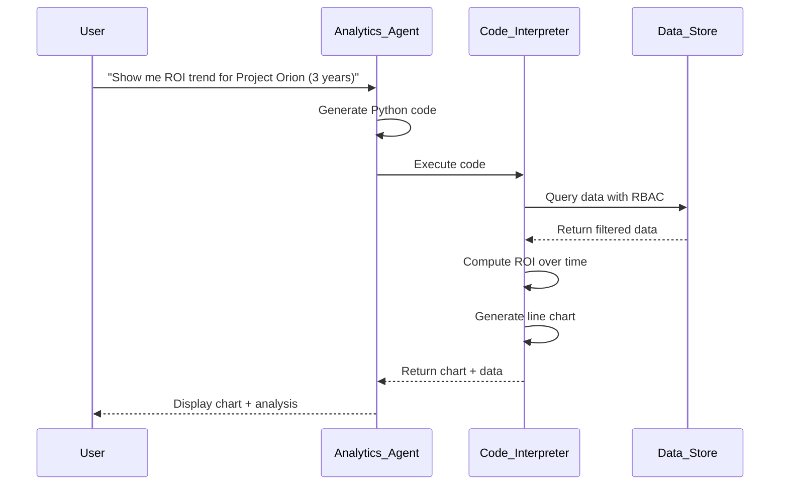

**Sample Generated Code**:

```python
# Auto-generated by Analytics Agent
import pandas as pd
import plotly.graph_objects as go

# Query data (RBAC applied at data layer)
data = query_dwh("""
    SELECT
        fiscal_year,
        SUM(net_benefit) as total_benefit,
        SUM(total_investment) as total_investment,
        SUM(net_benefit) / NULLIF(SUM(total_investment), 0) as roi
    FROM project_financial_performance
    WHERE project_name = 'Project Orion'
        AND fiscal_year >= 2021
    GROUP BY fiscal_year
    ORDER BY fiscal_year
""", user_context=current_user)

# Calculate ROI
df = pd.DataFrame(data)

# Create visualization
fig = go.Figure()
fig.add_trace(go.Scatter(
    x=df['fiscal_year'],
    y=df['roi'] * 100,
    mode='lines+markers',
    name='ROI %',
    line=dict(color='#1f77b4', width=3),
    marker=dict(size=10)
))

fig.update_layout(
    title='Project Orion ROI Trend (2021-2023)',
    xaxis_title='Fiscal Year',
    yaxis_title='ROI (%)',
    template='plotly_white'
)

# Return results
output = {
    'chart': fig,
    'summary': f"Project Orion's ROI improved from {df.iloc[0]['roi']*100:.1f}% in {df.iloc[0]['fiscal_year']} to {df.iloc[-1]['roi']*100:.1f}% in {df.iloc[-1]['fiscal_year']}",
    'data': df.to_dict()
}
```

#### 2.2.5 Report Generation Agent

**Purpose**: Creates professional reports in Excel, PowerPoint, or PDF formats.

**Output Formats**:

| Format | Use Case | Key Features |
|--------|----------|--------------|
| Excel | Data exports, detailed analysis | Formatted tables, charts, formulas, multiple sheets |
| PowerPoint | Executive summaries, presentations | Branded templates, charts, bullet points, speaker notes |
| PDF | Formal reports, audit trails | Professional layout, headers/footers, table of contents |

**PowerPoint Generation Example**:

```python
from pptx import Presentation
from pptx.util import Inches, Pt

class FinancialPresentationGenerator:
    def generate_monthly_pl_summary(self, data: dict, user_context: dict):
        prs = Presentation('templates/corporate_template.pptx')

        # Slide 1: Title
        slide = prs.slides.add_slide(prs.slide_layouts[0])
        title = slide.shapes.title
        subtitle = slide.placeholders[1]
        title.text = f"P&L Summary - {data['period']}"
        subtitle.text = f"{data['business_unit']} | Generated for {user_context['name']}"

        # Slide 2: Key Metrics
        slide = prs.slides.add_slide(prs.slide_layouts[1])
        title = slide.shapes.title
        title.text = "Key Financial Metrics"

        # Add metrics table
        self.add_metrics_table(slide, data['metrics'])

        # Slide 3: Revenue Analysis
        slide = prs.slides.add_slide(prs.slide_layouts[5])
        title = slide.shapes.title
        title.text = "Revenue Analysis"

        # Add chart
        self.add_revenue_chart(slide, data['revenue_trend'])

        # Slide 4: Expense Breakdown
        # ... more slides ...

        return prs
```

#### 2.2.6 Planning Agent

**Purpose**: Handles multi-step tasks requiring complex orchestration.

**Planning Approach**: Plan-and-Execute pattern

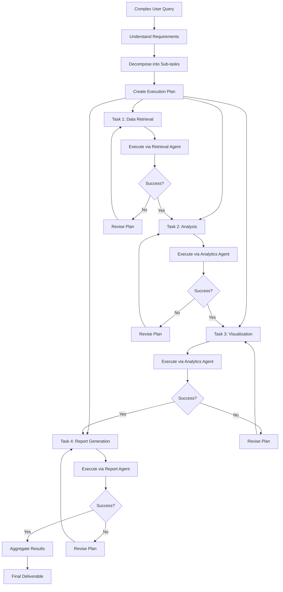

### 2.3 Tool Ecosystem

#### Core Tools

```python
# Tool Registry
tools = {
    # Data Access Tools
    "vector_search": VectorSearchTool(vector_store=vector_db, rbac_engine=rbac),
    "sql_query": SQLQueryTool(database=dwh, rbac_engine=rbac),
    "hybrid_search": HybridSearchTool(vector_store=vector_db, bm25_index=bm25, rbac_engine=rbac),

    # API Tools (Real-time Data)
    "sap_realtime": SAPRealtimeAPI(credentials=sap_creds, user_context_provider=rbac),
    "market_data": MarketDataAPI(provider="bloomberg", cache_ttl=300),
    "currency_exchange": CurrencyExchangeAPI(provider="exchangerates"),

    # Analysis Tools
    "code_interpreter": CodeInterpreterTool(sandbox="docker", allowed_libraries=["pandas", "numpy", "matplotlib", "seaborn", "plotly", "scipy", "statsmodels"]),
    "financial_calculator": FinancialCalculatorTool(formulas=financial_formulas),
    "forecasting": ForecastingTool(models=["arima", "prophet", "lstm"]),

    # Output Generation Tools
    "excel_generator": ExcelGeneratorTool(template_dir="templates/excel"),
    "powerpoint_generator": PowerPointGeneratorTool(template_dir="templates/pptx"),
    "pdf_generator": PDFGeneratorTool(template_dir="templates/pdf"),
    "chart_generator": ChartGeneratorTool(library="plotly"),

    # Utility Tools
    "date_calculator": DateCalculatorTool(),
    "unit_converter": UnitConverterTool(),
    "translation": TranslationTool(model="nllb-200")
}
```

### 2.4 Model Context Protocol (MCP) Integration

**Why MCP?**
- Decouples agent logic from tool implementations
- Enables tool reusability across different AI systems
- Standardizes tool interfaces for easier maintenance
- Facilitates sharing tools with other teams

**MCP Architecture**:

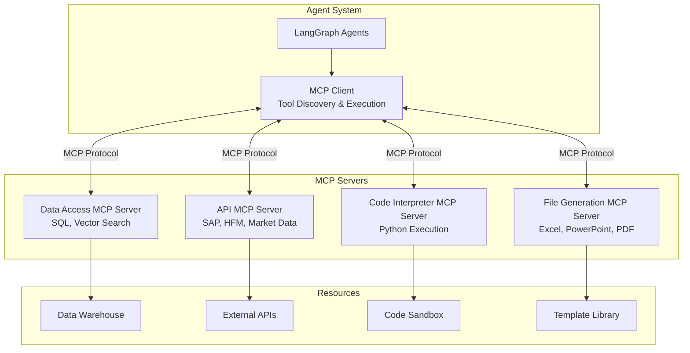

**Sample MCP Server Definition**:

```python
# mcp_servers/data_access_server.py
from mcp.server import Server
from mcp.types import Tool, TextContent

class DataAccessMCPServer(Server):
    def __init__(self):
        super().__init__("data-access-server")

    @self.tool()
    async def vector_search(
        query: str,
        top_k: int = 10,
        filters: dict = None
    ) -> list:
        """Semantic search over embedded financial documents"""
        # Implementation
        pass

    @self.tool()
    async def sql_query(
        query: str,
        parameters: dict = None,
        user_context: dict = None
    ) -> dict:
        """Execute SQL query with RBAC enforcement"""
        # Implementation
        pass
```

### 2.5 Agent-to-Agent (A2A) Communication

**Future-Proofing for Cross-Team Collaboration**:

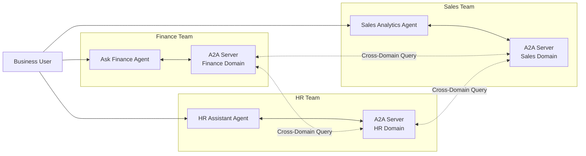

**Example Cross-Domain Query**:
```
User to Finance Agent: "What's our revenue per employee in Q3?"

Finance Agent → Sales A2A Server: "Get Q3 revenue"
Finance Agent → HR A2A Server: "Get employee headcount for Q3"
Finance Agent: Calculate and respond
```

### 2.6 Long-Term Memory Implementation

**Purpose**: Personalize agent behavior based on user interactions and preferences.

**Memory Architecture**:

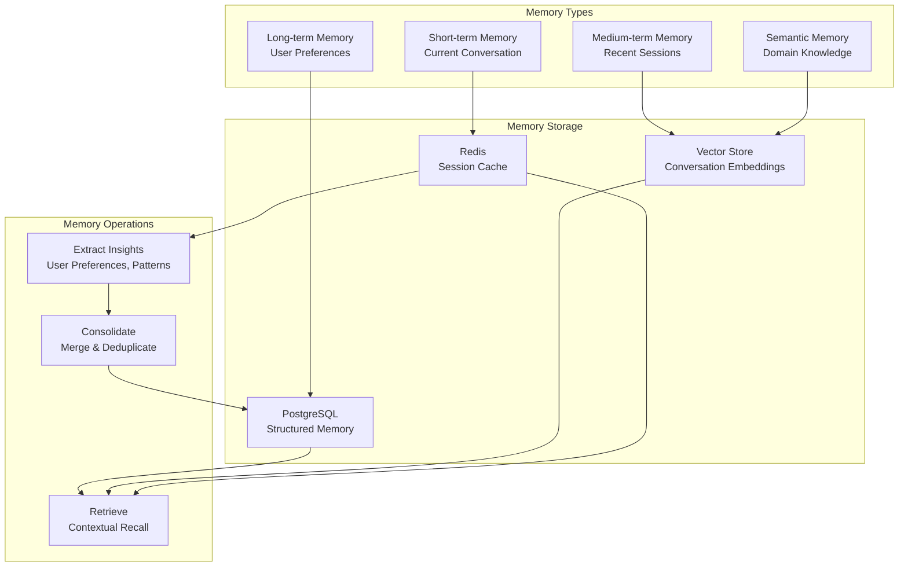

**Memory Schema**:

```sql
-- Long-term Memory Tables
CREATE TABLE user_preferences (
    user_id INTEGER REFERENCES users(id),
    preference_key VARCHAR(100),
    preference_value JSONB,
    confidence_score FLOAT,
    last_updated TIMESTAMP,
    PRIMARY KEY (user_id, preference_key)
);

CREATE TABLE conversation_history (
    id SERIAL PRIMARY KEY,
    user_id INTEGER REFERENCES users(id),
    session_id UUID,
    turn_number INTEGER,
    user_message TEXT,
    agent_response TEXT,
    intent VARCHAR(100),
    entities JSONB,
    timestamp TIMESTAMP,
    embedding VECTOR(1536)
);

CREATE TABLE user_insights (
    id SERIAL PRIMARY KEY,
    user_id INTEGER REFERENCES users(id),
    insight_type VARCHAR(50), -- e.g., 'frequent_query', 'preferred_format', 'business_focus'
    insight_value JSONB,
    evidence_count INTEGER,
    confidence FLOAT,
    created_at TIMESTAMP,
    updated_at TIMESTAMP
);
```

**Memory Extraction Pipeline**:

```python
class MemoryExtractor:
    def extract_preferences(self, conversation_history: list) -> dict:
        """Extract user preferences from conversation history"""
        preferences = {}

        # Detect preferred output formats
        format_counts = self.count_format_requests(conversation_history)
        if format_counts:
            preferences['preferred_format'] = max(format_counts, key=format_counts.get)

        # Detect frequently queried business units
        bu_mentions = self.extract_business_unit_mentions(conversation_history)
        if bu_mentions:
            preferences['primary_business_units'] = bu_mentions[:3]

        # Detect preferred level of detail
        detail_level = self.infer_detail_preference(conversation_history)
        preferences['detail_level'] = detail_level

        # Detect time periods of interest
        time_periods = self.extract_time_period_patterns(conversation_history)
        preferences['typical_time_periods'] = time_periods

        return preferences
```

### 2.7 Model Selection Strategy

**Multi-Model Approach**:

| Use Case | Model | Rationale |
|----------|-------|-----------|
| Primary Agent Reasoning | gemini-2.5-pro / gpt-5 | Best reasoning, finance domain understanding |
| Query Understanding | claude-haiku-4.5 / gpt-5-nano | Fast intent classification |
| Embeddings | text-embedding-3-large | High-quality semantic representations |
| Code Generation | claude-sonnet-4.5 / gpt-oss-120b | Superior Python code generation |
| Reranking | rerank-v3.5| Specialized for relevance scoring |
| Fine-tuned Financial QA | gpt-oss-20b (fine-tuned) | Cost-effective for specialized tasks |

**Fine-Tuning Strategy**:

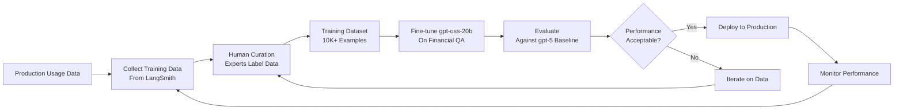

---

## 3. Security Architecture

### 3.1 Authentication & Authorization Flow

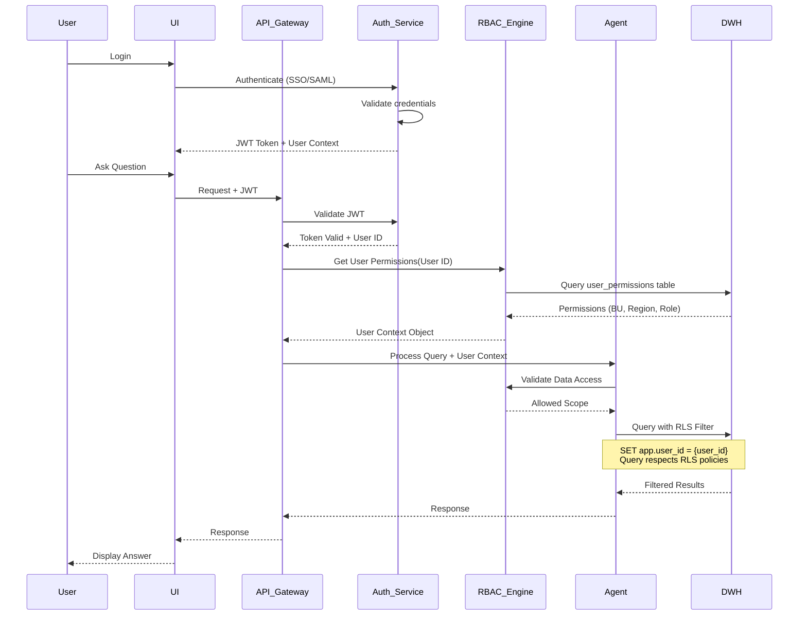

### 3.2 Data Access Control Matrix

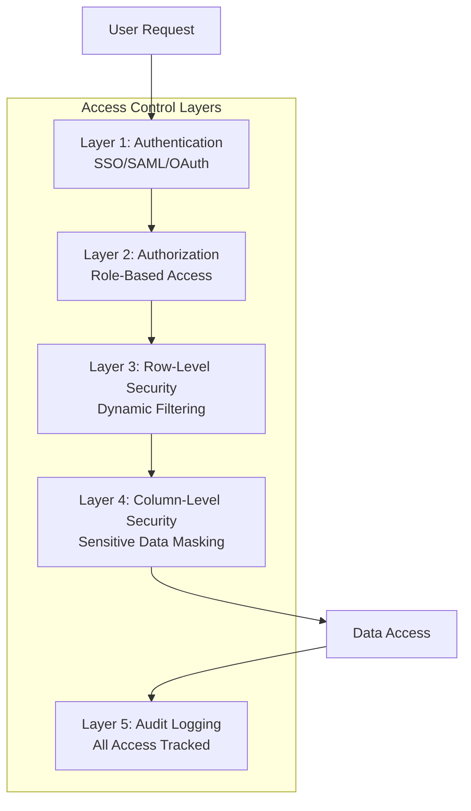

**Example RBAC Rules**:

```yaml
# rbac_config.yaml
roles:
  group_cfo:
    description: "Group Chief Financial Officer"
    permissions:
      - data_access: full
      - business_units: "*"
      - regions: "*"
      - sensitive_data: unmasked
      - actions: [read, write, export, share]
      - time_range: unlimited

  bu_general_manager:
    description: "Business Unit General Manager"
    permissions:
      - data_access: bu_level
      - business_units: [assigned_bu]
      - regions: "*"
      - sensitive_data: partial_mask
      - actions: [read, write, export]
      - time_range: unlimited

  regional_finance_manager:
    description: "Regional Finance Manager"
    permissions:
      - data_access: regional_level
      - business_units: [assigned_bu]
      - regions: [assigned_region]
      - sensitive_data: masked
      - actions: [read, export]
      - time_range: last_3_years

  finance_analyst:
    description: "Finance Analyst"
    permissions:
      - data_access: query_only
      - business_units: [assigned_bu]
      - regions: [assigned_region]
      - sensitive_data: fully_masked
      - actions: [read]
      - time_range: last_1_year
```

### 3.3 Data Masking Strategies

```python
class DataMasker:
    """Apply column-level security based on user role"""

    SENSITIVE_COLUMNS = {
        'employee_salary': ['salary', 'bonus', 'total_compensation'],
        'customer_pii': ['customer_name', 'email', 'phone'],
        'strategic_projects': ['project_name', 'investment_amount', 'roi']
    }

    def mask_data(self, dataframe: pd.DataFrame, user_role: str) -> pd.DataFrame:
        mask_level = self.get_mask_level(user_role)

        if mask_level == 'unmasked':
            return dataframe

        if mask_level == 'partial_mask':
            # Show aggregated data only
            for col in self.SENSITIVE_COLUMNS['employee_salary']:
                if col in dataframe.columns:
                    dataframe[col] = dataframe[col].apply(self.partial_mask)

        if mask_level == 'fully_masked':
            # Replace with masked values
            for category, cols in self.SENSITIVE_COLUMNS.items():
                for col in cols:
                    if col in dataframe.columns:
                        dataframe[col] = '***MASKED***'

        return dataframe

    def partial_mask(self, value):
        """Show range instead of exact value"""
        if pd.isna(value):
            return value

        # Round to nearest range
        if value < 50000:
            return "< $50K"
        elif value < 100000:
            return "$50K - $100K"
        elif value < 200000:
            return "$100K - $200K"
        else:
            return "> $200K"
```

### 3.4 Audit Logging

**Comprehensive Audit Trail**:

```sql
CREATE TABLE audit_logs (
    id SERIAL PRIMARY KEY,
    user_id INTEGER REFERENCES users(id),
    session_id UUID,
    action_type VARCHAR(50), -- query, export, share, delete
    resource_type VARCHAR(50), -- table, report, file
    resource_id VARCHAR(255),
    query_text TEXT,
    data_accessed JSONB, -- Metadata about accessed data
    ip_address INET,
    user_agent TEXT,
    timestamp TIMESTAMP DEFAULT NOW(),
    success BOOLEAN,
    error_message TEXT
);

-- Index for fast audit queries
CREATE INDEX idx_audit_user_time ON audit_logs(user_id, timestamp);
CREATE INDEX idx_audit_resource ON audit_logs(resource_type, resource_id);
```

---

## 4. Evaluation & Monitoring

### 4.1 Evaluation Framework

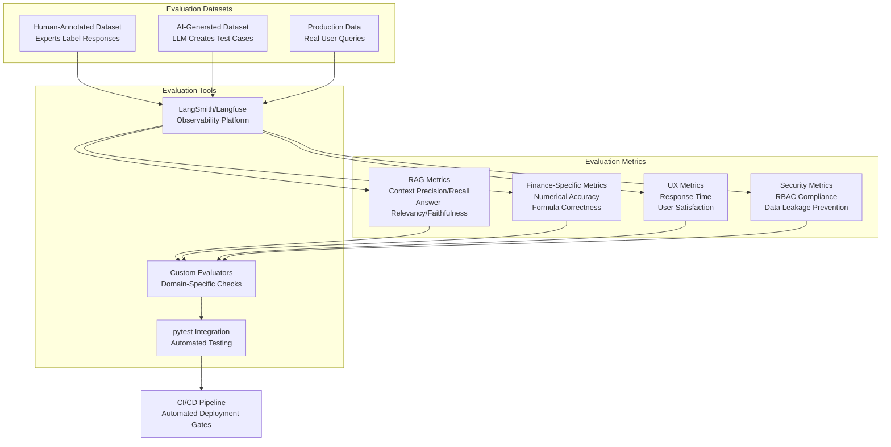

### 4.2 Evaluation Metrics Definition

#### RAG Metrics

```python
from ragas import evaluate
from ragas.metrics import (
    context_precision,
    context_recall,
    answer_relevancy,
    faithfulness,
)

# Evaluate RAG pipeline
evaluation_results = evaluate(
    dataset=eval_dataset,
    metrics=[
        context_precision,  # Are retrieved contexts relevant?
        context_recall,     # Did we retrieve all relevant contexts?
        answer_relevancy,   # Is the answer relevant to the question?
        faithfulness,       # Is the answer faithful to the context?
    ]
)
```

**Target Thresholds**:
- Context Precision: > 0.85
- Context Recall: > 0.80
- Answer Relevancy: > 0.90
- Faithfulness: > 0.95 (critical for financial accuracy)

#### Financial Accuracy Metrics

```python
class FinancialAccuracyEvaluator:
    """Custom evaluator for financial calculations"""

    def evaluate_numerical_accuracy(self, predicted: float, actual: float, tolerance: float = 0.01):
        """Check if numerical answer is within tolerance"""
        relative_error = abs(predicted - actual) / abs(actual)
        return relative_error <= tolerance

    def evaluate_formula_correctness(self, generated_formula: str, expected_formula: str):
        """Verify financial formula is mathematically equivalent"""
        # Parse and compare AST
        pass

    def evaluate_citation_completeness(self, response: str, required_citations: list):
        """Ensure all data sources are cited"""
        cited_sources = self.extract_citations(response)
        return all(src in cited_sources for src in required_citations)
```

#### Security Compliance Metrics

```python
class SecurityComplianceEvaluator:
    """Verify RBAC enforcement and data isolation"""

    def test_rbac_enforcement(self, test_cases: list):
        """Test that users only see authorized data"""
        results = []
        for case in test_cases:
            response = query_agent(case['query'], user_context=case['user'])
            data_accessed = extract_data_entities(response)

            # Check if accessed data is within permitted scope
            is_compliant = all(
                entity in case['permitted_entities']
                for entity in data_accessed
            )
            results.append({
                'case': case['name'],
                'compliant': is_compliant,
                'violated_entities': [e for e in data_accessed if e not in case['permitted_entities']]
            })

        return results

    def test_data_leakage_prevention(self, test_cases: list):
        """Test that sensitive data is properly masked"""
        # Implementation
        pass
```

### 4.3 Continuous Evaluation in CI/CD

```yaml
# .github/workflows/agent_evaluation.yml
name: Agent Evaluation Pipeline

on:
  pull_request:
    branches: [main, develop]
  schedule:
    - cron: '0 0 * * *'  # Daily evaluation

jobs:
  evaluate:
    runs-on: ubuntu-latest
    steps:
      - name: Checkout code
        uses: actions/checkout@v3

      - name: Setup Python
        uses: actions/setup-python@v4
        with:
          python-version: '3.11'

      - name: Install dependencies
        run: |
          pip install -r requirements.txt
          pip install pytest ragas langsmith

      - name: Run RAG evaluation
        run: |
          pytest tests/evaluation/test_rag_metrics.py --junitxml=results/rag_results.xml

      - name: Run financial accuracy tests
        run: |
          pytest tests/evaluation/test_financial_accuracy.py --junitxml=results/accuracy_results.xml

      - name: Run security compliance tests
        run: |
          pytest tests/evaluation/test_security_compliance.py --junitxml=results/security_results.xml

      - name: Evaluate with LangSmith
        env:
          LANGSMITH_API_KEY: ${{ secrets.LANGSMITH_API_KEY }}
        run: |
          python scripts/run_langsmith_evaluation.py

      - name: Check evaluation thresholds
        run: |
          python scripts/check_eval_thresholds.py --results-dir results/

      - name: Upload results
        uses: actions/upload-artifact@v3
        with:
          name: evaluation-results
          path: results/

      - name: Comment PR with results
        if: github.event_name == 'pull_request'
        uses: actions/github-script@v6
        with:
          script: |
            // Post evaluation results as PR comment
```

### 4.4 LLMOps Platform Integration

**LangSmith/Langfuse Setup**:

```python
from langsmith import Client
from langsmith.run_helpers import traceable

client = Client()

@traceable(run_type="chain", name="ask_finance_agent")
def process_query(query: str, user_context: dict):
    """Main agent entry point with tracing"""

    # All sub-operations are automatically traced
    supervisor_response = supervisor_agent.invoke({
        "query": query,
        "user_context": user_context
    })

    return supervisor_response

# Annotate runs for evaluation
def annotate_run(run_id: str, score: float, feedback: str):
    client.create_feedback(
        run_id=run_id,
        key="user_satisfaction",
        score=score,
        comment=feedback
    )
```

**Observability Dashboard Metrics**:

- **Latency Metrics**: p50, p95, p99 response times
- **Token Usage**: Input/output tokens per query
- **Error Rates**: By error type and agent
- **RBAC Events**: Permission denials, data access patterns
- **User Satisfaction**: Thumbs up/down, explicit ratings
- **Cost Tracking**: $ per query, by model and user

---

## 5. Deployment Architecture

### 5.1 Cloud Infrastructure

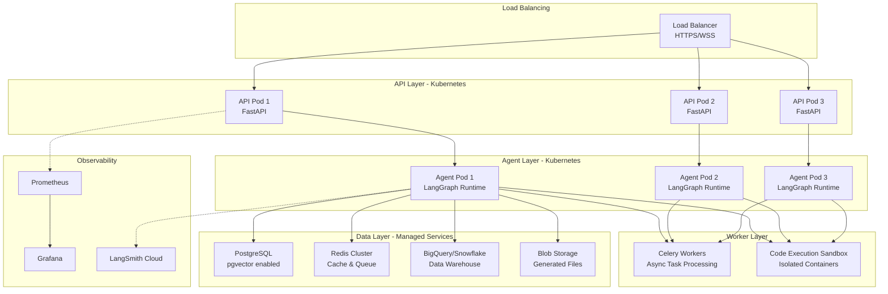

### 5.2 Scalability Considerations

**Horizontal Scaling Strategy**:

| Component | Scaling Trigger | Min Replicas | Max Replicas | Scaling Metric |
|-----------|----------------|--------------|--------------|----------------|
| API Pods | CPU > 70% | 1 | 10 | CPU, Request Rate |
| Agent Pods | Queue Depth > 50 | 5 | 20 | Queue Depth, Latency |
| Celery Workers | Task Queue > 100 | 1 | 10 | Queue Length |
| Code Sandboxes | On-demand | 0 | 10 | Active Executions |

**Database Scaling**:

```yaml
# PostgreSQL Scaling Configuration
postgresql:
  primary:
    resources:
      requests:
        cpu: "4"
        memory: "16Gi"
      limits:
        cpu: "8"
        memory: "32Gi"
    storage: "1Ti"
    storageClass: "ssd"

  readReplicas:
    count: 3
    resources:
      requests:
        cpu: "2"
        memory: "8Gi"

  connectionPooling:
    enabled: true
    maxConnections: 200
    poolSize: 100

  backup:
    enabled: true
    schedule: "0 2 * * *"
    retention: 30
```

### 5.3 High Availability Design

**Multi-Region Deployment**:

```
Region 1 (Primary)           Region 2 (Failover)
├── API Cluster              ├── API Cluster (standby)
├── Agent Cluster            ├── Agent Cluster (standby)
├── PostgreSQL (primary)     ├── PostgreSQL (read replica)
├── Redis (master)           ├── Redis (replica)
└── Vector DB (primary)      └── Vector DB (synced)
```

**Disaster Recovery**:
- **RPO (Recovery Point Objective)**: < 5 minutes
- **RTO (Recovery Time Objective)**: < 15 minutes
- **Backup Strategy**:
  - Continuous replication for PostgreSQL
  - Daily full backups
  - Point-in-time recovery enabled

---

## 6. Development Workflow

### 6.1 Agent Development Lifecycle

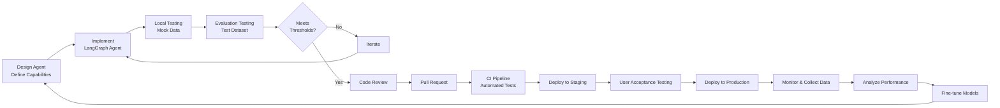

### 6.2 Testing Strategy

**Test Pyramid**:

```
                 /\
                /  \
               /E2E \           E2E Tests (10%)
              /Tests \          - Full user workflows
             /________\         - Multi-agent scenarios
            /          \
           / Integration\       Integration Tests (30%)
          /    Tests     \      - Agent-tool interactions
         /______________\       - Database queries with RBAC
        /                \
       /   Unit Tests      \    Unit Tests (60%)
      /                    \   - Individual functions
     /______________________\  - Tool implementations
                                - Utility functions
```

**Test Examples**:

```python
# Unit Test
def test_rbac_filter_generation():
    """Test that RBAC filter is correctly generated"""
    user_context = {
        "user_id": 123,
        "role": "bu_general_manager",
        "business_units": ["BU_ELECTRONICS"]
    }

    filter_clause = generate_rbac_filter(user_context)

    assert "business_unit = 'BU_ELECTRONICS'" in filter_clause
    assert "user_id = 123" not in filter_clause  # Should not expose user_id

# Integration Test
def test_retrieval_agent_with_rbac():
    """Test retrieval agent respects RBAC"""
    query = "What was Q2 revenue?"

    # User with limited access
    limited_user = {"role": "finance_analyst", "business_units": ["BU_CONSUMER"]}
    result_limited = retrieval_agent.invoke(query, user_context=limited_user)

    # User with full access
    full_user = {"role": "group_cfo", "business_units": ["*"]}
    result_full = retrieval_agent.invoke(query, user_context=full_user)

    # Assert limited user gets filtered results
    assert len(result_full["documents"]) > len(result_limited["documents"])

# E2E Test
def test_full_query_to_powerpoint():
    """Test complete flow from query to PowerPoint generation"""
    query = "Create a Q3 P&L summary for Electronics division"
    user_context = {"role": "bu_general_manager", "business_units": ["BU_ELECTRONICS"]}

    response = process_query(query, user_context)

    assert response["status"] == "success"
    assert response["output_type"] == "powerpoint"
    assert os.path.exists(response["file_path"])

    # Validate PowerPoint content
    prs = Presentation(response["file_path"])
    assert len(prs.slides) >= 3
    assert "Electronics" in prs.slides[0].shapes.title.text
```

---

## 7. Future Enhancements

### 7.1 Short-term Roadmap

1. **MVP with Evaluation**
   - Build POC, MVP with minimum features
   - Establish performance benchmarks for evaluation

2. **Data Platform**
   - Build data warehouse with proper data architecture
   - Build ETL/ELT data pipelines
   - Initialize data governance

3. **Multi-Modal Support**
   - OCR for scanned financial documents
   - Chart/graph understanding for visual data extraction

4. **Advanced Analytics**
   - Predictive analytics (forecasting, scenario analysis)
   - Anomaly detection in financial data
   - What-if analysis capabilities

5. **Collaboration Features**
   - Collaborative report building
   - Feedback and comment on generated insights
   - Share queries and results with team members

### 7.2 Mid-term Roadmap

1. **Real-time Data Integration**
   - Streaming data pipelines for real-time financial metrics
   - WebSocket connections for live dashboard updates
   - Event-driven architecture for immediate alerts

2. **Advanced Multi-Agent Orchestration**
   - Hierarchical agent structures for complex workflows
   - Specialized agents for different financial domains (FP&A, Treasury, Tax)
   - Cross-functional agent collaboration (Finance + HR + Sales)

3. **Enhanced Financial Understanding**
   - Fine-tune domain-specific model on company's financial data
   - Implement specialized financial formula validator
   - Add support for custom financial metrics and KPIs

4. **Regulatory Compliance**
   - Automated compliance checking (SOX, IFRS, GAAP)
   - Audit trail generation for regulatory reporting
   - Automated journal entry validation

5. **Mobile-First Experience**
   - Native iOS/Android apps
   - Offline mode with sync capabilities
   - Push notifications for important financial events

### 7.3 Long-term Vision

1. **Autonomous Financial Operations**
   - Automated monthly close processes
   - Self-service report generation without human intervention
   - Intelligent alerting for financial anomalies

2. **Global Expansion**
   - Multi-currency and multi-GAAP support
   - Country-specific tax and regulatory compliance
   - Support for multiple languages

3. **Advanced AI Capabilities**
   - Reinforcement learning for continuous improvement
   - Federated learning across business units
   - Explainable AI with detailed reasoning chains

4. **Ecosystem Integration**
   - Marketplace for third-party financial tools
   - Open API for external developers
   - Integration with major ERP ecosystems

---

## 8. Cost Optimization Strategies

### 8.1 Model Cost Optimization

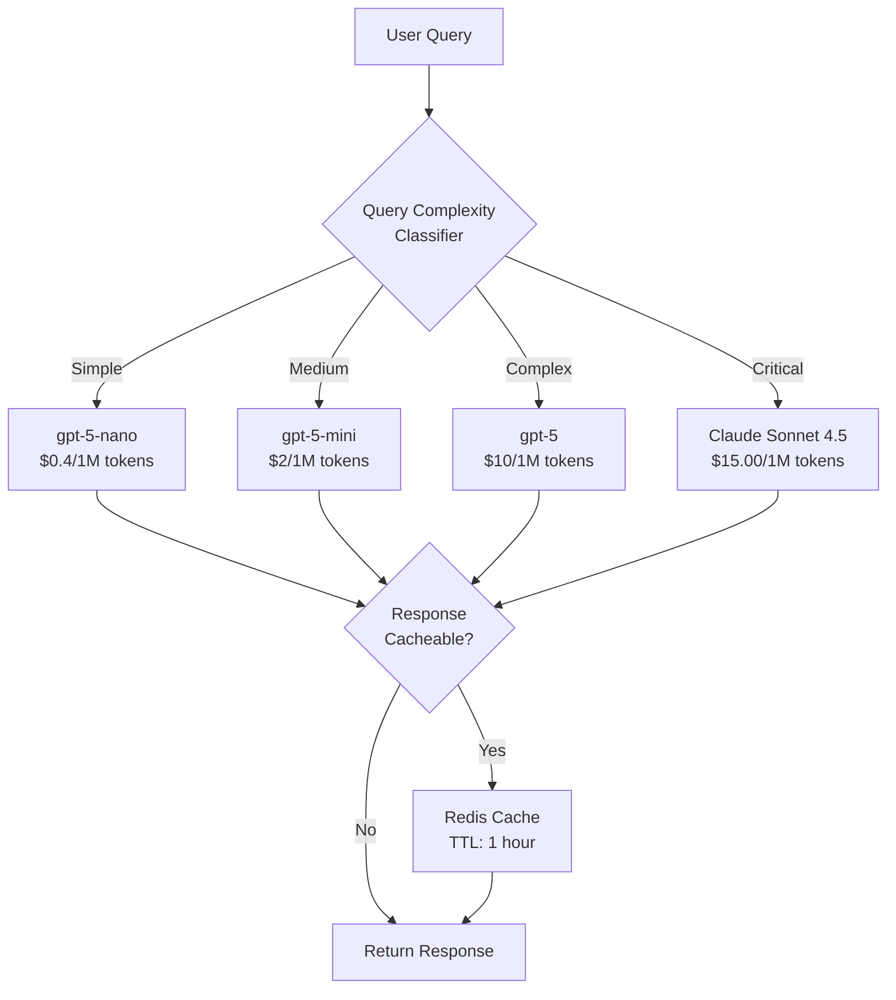

**Cost Reduction Tactics**:

1. **Prompt Caching**: Cache system prompts to reduce token usage by 80%
2. **Semantic Caching**: Cache responses to similar queries using vector similarity
3. **Model Routing**: Use cheaper models for simple queries, expensive models for complex ones
4. **Batch Processing**: Group similar queries for efficient processing
5. **Fine-tuned Small Models**: Replace expensive API calls with fine-tuned Llama 3 8B

**Expected Cost Savings**:
- Baseline cost: $0.50 per query
- Optimized cost: $0.12 per query (76% reduction)
- At 100K queries/month: $38K monthly savings

### 8.2 Infrastructure Cost Optimization

**Resource Right-Sizing**:

```yaml
# Before Optimization
api_pod:
  cpu: "2000m"
  memory: "4Gi"
  replicas: 10

# After Optimization (based on actual usage)
api_pod:
  cpu: "1000m"  # 50% reduction
  memory: "2Gi"  # 50% reduction
  replicas: 6    # 40% reduction during off-peak
  autoscaling:
    enabled: true
    minReplicas: 3
    maxReplicas: 15
    targetCPU: 70
```

**Spot Instance Usage**:
- Use spot instances for Celery workers (70% cost savings)
- Use preemptible VMs for code execution sandboxes (60% cost savings)

---

## 9. Deployment Checklist

### Pre-Production Checklist

- [ ] **Security**
  - [ ] SSO/SAML authentication configured
  - [ ] RBAC policies defined and tested
  - [ ] Row-level security policies implemented
  - [ ] Column-level masking configured
  - [ ] Audit logging enabled
  - [ ] Secrets management configured (AWS Secrets Manager / HashiCorp Vault)
  - [ ] Network security groups configured
  - [ ] TLS/SSL certificates installed
  - [ ] API rate limiting configured

- [ ] **Data Layer**
  - [ ] Data warehouse provisioned and configured
  - [ ] Vector database deployed
  - [ ] Data pipelines tested end-to-end
  - [ ] Backup and recovery tested
  - [ ] Data quality tests passing
  - [ ] Performance benchmarks met
  - [ ] Connection pooling optimized

- [ ] **Agent Layer**
  - [ ] All agents tested individually
  - [ ] Multi-agent workflows tested
  - [ ] Tool integrations verified
  - [ ] Error handling and retries configured
  - [ ] Timeout policies set
  - [ ] Memory management tested

- [ ] **Evaluation**
  - [ ] Evaluation dataset created (1000+ examples)
  - [ ] All metrics meet thresholds
  - [ ] Security compliance tests passing
  - [ ] Load testing completed
  - [ ] User acceptance testing completed

- [ ] **Monitoring**
  - [ ] LangSmith/Langfuse configured
  - [ ] Prometheus and Grafana dashboards created
  - [ ] Alert rules configured
  - [ ] On-call rotation established
  - [ ] Runbooks documented

- [ ] **Documentation**
  - [ ] Architecture documentation complete
  - [ ] API documentation published
  - [ ] User guide created
  - [ ] Admin guide created
  - [ ] Troubleshooting guide created

---

## Appendix

### A. Technology Stack Summary

| Layer | Technology | Purpose |
|-------|-----------|---------|
| **Frontend** | TypeScript/React | Web UI |
| **API Layer** | FastAPI | REST API |
| **Agent Framework** | LangGraph | Multi-agent orchestration |
| **LLM Provider** | Claude Sonnet 4.5, GPT-5 | Primary reasoning |
| **Embeddings** | text-embedding-3-large | Semantic search |
| **Data Warehouse** | BigQuery/Snowflake | Structured + vector data |
| **Vector Store** | PostgreSQL + pgvector | Dedicated vector search |
| **Cache** | Redis | Hot data caching |
| **Workflow Orchestration** | Airflow/Dagster | Data pipelines |
| **Transformation** | dbt | SQL transformations |
| **Observability** | LangSmith/Langfuse | LLM monitoring |
| **Metrics** | Prometheus + Grafana | Infrastructure monitoring |
| **Container Orchestration** | Kubernetes | Deployment & scaling |
| **Code Execution** | Docker | Sandboxed Python execution |

### B. Glossary

- **RBAC**: Role-Based Access Control
- **RLS**: Row-Level Security
- **DWH**: Data Warehouse
- **RAG**: Retrieval-Augmented Generation
- **MCP**: Model Context Protocol
- **A2A**: Agent-to-Agent
- **LLMOps**: Large Language Model Operations
- **CI/CD**: Continuous Integration/Continuous Deployment
- **P&L**: Profit and Loss
- **Opex**: Operating Expenses
- **Capex**: Capital Expenditures
- **ROI**: Return on Investment
- **EBIT**: Earnings Before Interest and Tax

---

## Contributing

We welcome contributions! Please see CONTRIBUTING.md for guidelines.

## Contact

For questions or support, contact: npt.dc@outlook.com
